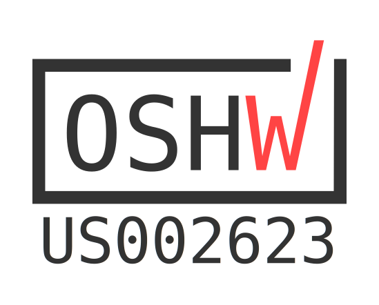
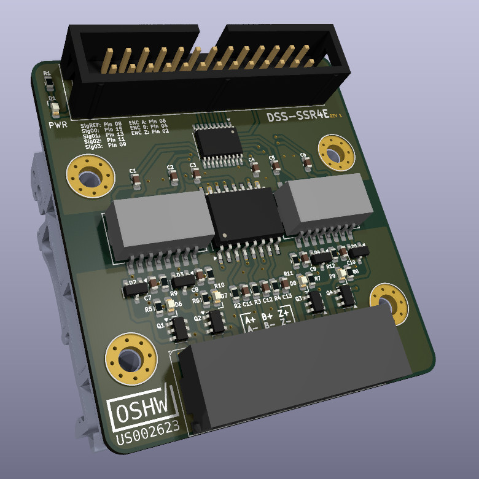

DSS-SSR4E
============

The "DSS-SSR4E" is a OSHWA Certified hardware design, providing four isolated SSR outputs and a single isolated
ABZ encoder input. Compatible with Mesa Ethernet Anything I/O Cards and Mesa Electronics HostMot2 configurations.

DSS-SSR4E  
"Desert Shed Stuido SSR x4 + Encoder"

This repository is aimed towards those who wish to manufacture their own boards. 

Media
=======

| KICAD RENDER           | HAND SOLDERED PROTOTYPE  |
| ---------------------- | ------------------------ |
| |  |

| BENCHTEST VIDEO |
| --------------- |
|  |

Contribute 
===========
I am #notsponsored ! Your direct support by using my affiliate links / shopping with affiliate retailers goes a long way
in helping me to produce more open source hardware. Thank You. 

Amazon: https://amzn.to/3v1R42O  
Openbuilds:  https://openbuildspartstore.com/?ref=hGMJTVfeW_r4W

License
=======

DSS-SSR4E | https://github.com/DesertShedStudio/DSS-SSR4E  
Copyright (c) Desert Shed Studio

This source describes Open Hardware and is licensed under the CERN-OHL-S v2.

You may redistribute and modify this source and make products using it under  
the terms of the CERN-OHL-S v2 (https://ohwr.org/cern_ohl_s_v2.txt).  

This source is distributed WITHOUT ANY EXPRESS OR IMPLIED WARRANTY,  
INCLUDING OF MERCHANTABILITY, SATISFACTORY QUALITY AND FITNESS FOR A  
PARTICULAR PURPOSE. Please see the CERN-OHL-S v2 for applicable conditions.
